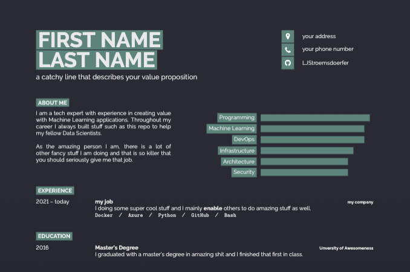
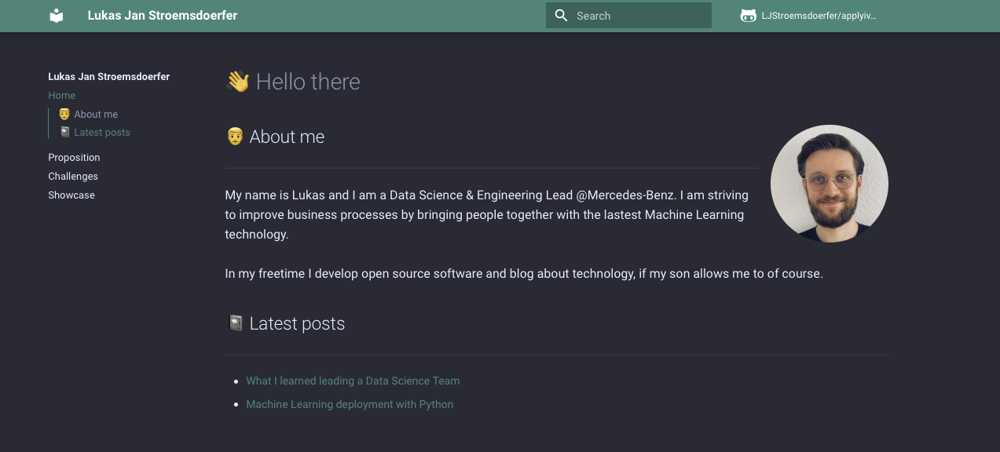

# 👋 - this is the applyiverse

## What is this about?

***

<i>''I fucking hate applying to jobs, it's super tedious and no fun at all.''   - most people at some point </i>

***

Well, not anymore. This repo contains everything you need to create an innovative and creative application. The cool thing is, you can have some fun on the way. Clone this repo and reuse everything to create your own fancy application to your dream job. 

## What can you expect?

Apart from some nice action workflows used in this repo, you will get everything you need to stand out during your application and interview process. In total you will find the following shortcuts:

<ol>
    <li>a kickass cover letter</li>
    <li>a kickass CV</li>
    <li>a nerdy webpage that helps you present yourself</li>
    <li>a python library and a demo notebook with a Data Science showcase</li>
    <li>a python bot that helps you prep for your interview</li>
</ol>

So, let's go into detail and best start with the application.

### The application

Hiring managers see tons of CVs and cover letters each day. So it can't hurt to have a visually appealing first introduction of yourself. I tweaked a super amazing <code>.tex</code> template by Jan Küster and Jan Vorisek a little and added it here. The originals can be found <a href="https://www.latextemplates.com/template/developer-cv">here</a>. 

    

The cover letter follows a similar style guide. Feel free to adjust and tweak the style to your liking. You will find the entire code and resources in the subdirectories <code>cv</code> and <code>letter</code>.

### The interview

Depending on what kind of role your interviewing for, you will have different stages. Surely, you will have some interview questions and more often than not, you will have to face some sort of case study or present a showcase. Most often you are competing for a role, so again, standing out can be helpful. I like to code and build small things, so to be super authentic in an interview situation I decided to build a small website to present myself. The website is actually based on material mkdocs, which is a documentation framework for mostly python libraries, but hey, I like it so what the heck. 

    

In addition, I built a little showcase. It is a pretty simple one taking Bitcoin (EUR) and prediction the next days high. I built a little python library for this and a jupyter notebook to demo it. This is quite simple, but you can adjust it the way you see fit. The cool thing though, however, you decide, you can embed the <code>.ipynb</code> file into the website.

On top of that, I have a little bot helping you to prepare for your job interview. The idea came to life when I had my first interviews for leadership positions. Apart from technical questions that are easy to answer, you will get some more philosophical questions, that require some thinking. To practice that, I fed the bot such questions.

## What is next?

This repo will always be evolving and if you have some specific ideas to make it cooler, please get in touch. Other than that, have fun using the resources here and good luck getting the jobs you desire.